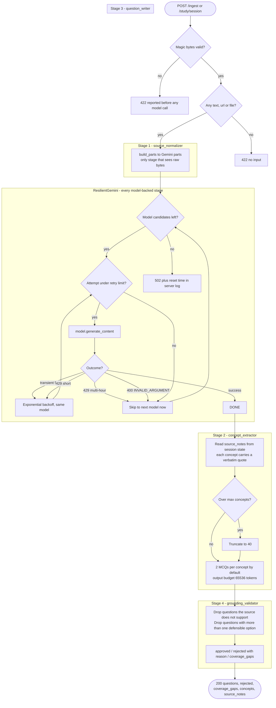

# Ingestion activity

Behavioral model of `/ingest` and the ingestion half of `POST /study/session`.
Four sequential model calls, one file per stage under `agent/study_buddy/ingest/`.

## Design notes

**Only stage 1 sees the raw bytes.** Pasted notes, PDFs, and slide photos arrive as
inline parts; a YouTube URL arrives as `file_data`. Stages 2-4 run with
`include_contents='none'` and read the previous stage's output from session state.
A PDF is uploaded once, not four times.

**Every schema field has a default.** ADK validates a stage's output against its
`output_schema`, and a validation error aborts the whole run. Quality decisions
belong to `grounding_validator`, not to Pydantic.

**Uploads are validated before any request.** Magic-byte checks reject a `.pdf`
without a `%PDF-` header and `%%EOF` trailer, and images without a PNG/JPEG/WebP
signature. This matters because a malformed upload answers `400 INVALID_ARGUMENT`
on *every* model, which is otherwise indistinguishable from a server outage.

## Why a 429 is not evidence the payload was fine

`ResilientGemini` treats a multi-hour `RetryInfo` (`retryDelay: "16531s"`) as
"try a different model" rather than something to back off from — the free tier caps
`generate_content_free_tier_requests` per day, per model, so retrying just burns
time.

But a `429` from a blocked model is deliberately **not** recorded as evidence that
the payload was sound. Otherwise a corrupt upload hides behind a quota error until
the next day instead of being reported as a `422`.

Two further subtleties the retry loop handles:

- **`models.list()` is not an availability signal.** `gemini-2.5-flash` and
  `gemini-3.1-flash` both appeared in the listing but returned `404` on
  `generate_content`. Availability has to be probed.
- **Each attempt gets a deep copy of the request.** `Gemini` rewrites
  `content.parts` in place, so a naive retry resends duplicated content.

## Cost and latency

| Property | Value |
| --- | --- |
| Model calls per run | 4, sequential |
| Wall clock, text-only notes | 3-4 minutes |
| Wall clock, short mixed request | ~35s |
| Free tier allowance | 20 requests/day **per model** |
| Ingestions per model per day | ~5 |
| Across the 4-model fallback chain | ~20/day |

One ingestion makes four requests against a twenty-request daily budget. This is a
batch operation triggered by an upload, not something to call on a keystroke.

`STUDYATHON_WRITER_MAX_OUTPUT_TOKENS` defaults to `65536`. Truncated JSON fails the
output schema and the questions get rejected, so raising this is the first thing to
try when a long upload produces no questions.

## The study loop reuses this

`POST /study/session` runs the same pipeline internally, then seeds iteration one
from `approved` — so the client makes one call instead of chaining `/ingest` then
`/study/*`, and the first iteration costs no model calls beyond ingestion itself.
From iteration two on, cost is one batched call per iteration that needs new
questions. See [study-loop-state.md](./study-loop-state.md).