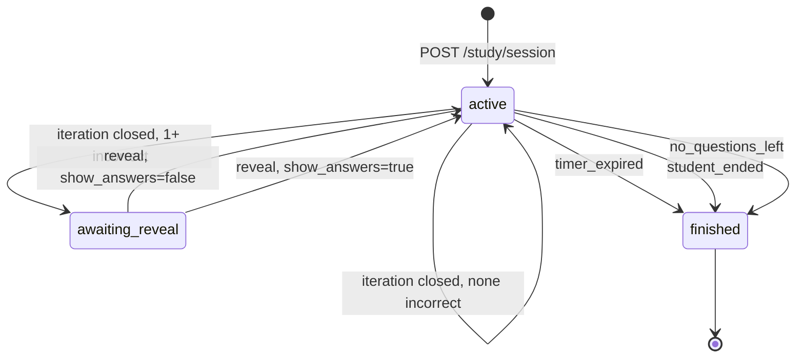

# Study session state machine

Behavioral model of the study loop, mirroring `agent/study_buddy/study/session.py`.
Three states: `active`, `awaiting_reveal`, `finished`.

## What each transition does

| Transition | Trigger | Effect |
| --- | --- | --- |
| `[*] → active` | `POST /study/session` | Ingestion runs first; iteration 1 is seeded from the already-validated bank, so opening a session costs no model calls beyond ingestion itself. |
| `active → active` | `POST /study/answer`, questions remain | Records the answer, returns the next question via `next_unanswered()`. |
| `active → active` | Iteration closed, **zero incorrect** | `should_escalate()` is true. New question per concept, difficulty bumped one tier. Costs one batched model call. |
| `active → awaiting_reveal` | Iteration closed, **one or more incorrect** | Returns `summary` with `answers: null`. Explanations are held server-side until the student asks. |
| `awaiting_reveal → active` | `show_answers: false` | Every wrong question gets the `CARRY` directive and is re-asked verbatim from memory. **Zero model calls.** |
| `awaiting_reveal → active` | `show_answers: true` | Wrong questions get `REWORD` (same concept, new stem and option wording). Answers and explanations are returned to the client. |
| `→ finished` | `timer_expired` | Deadline passed. |
| `→ finished` | `student_ended` | `POST /study/finish`. |
| `→ finished` | `no_questions_left` | The next iteration would have been empty; opening it would strand the student. |

## Outcome to directive mapping

How one question's outcome becomes its next iteration, from `study/rules.py`.
`UNANSWERED` means either skipped (`selected_index: null`) or never reached.

| Outcome | Directive | Next iteration | Model call |
| --- | --- | --- | --- |
| Whole set correct | `HARDER` | New question, one tier harder | 1 batched |
| Correct | `REWRITE` | A different question, same difficulty | 1 batched |
| Wrong, answers read | `REWORD` | Same idea, reworded | 1 batched |
| Wrong, answers declined | `CARRY` | Identical question again | none |
| Never answered | `DROP` | Ignored, not carried forward | none |

Two consequences worth knowing:

- **A skip is not a failure.** It is excluded from `requires_reveal()`, so a timer expiring mid-set cannot force a student through the reveal branch, and an explanation is never offered for something they never attempted.
- **`HARDER` saturates at `hard`.** A student who keeps clearing the set keeps getting fresh questions at maximum difficulty rather than the loop ending or jumping to an undefined tier.

## The timer is server-side

`_lookup()` and `get()` both run on **every** request and check
`status == active and time.time() >= deadline`. If true, the session flips to
`finished` with `finished_reason: "timer_expired"`.

Consequences: closing the app buys no extra time, a client that ignores the
countdown is still cut off, and `seconds_remaining` is for display only.

## Rejected transitions

| Condition | HTTP | Raised from |
| --- | --- | --- |
| Session unknown or aged out past the 6h TTL | `404` | `UnknownSession` |
| Answer while `awaiting_reveal` | `409` | `record_answer` |
| Answer an already-answered question | `409` | `record_answer` |
| Question not part of this iteration | `409` | `record_answer` |
| `selected_index` out of range for the question | `409` | `record_answer` |
| Reveal when not awaiting one | `409` | `submit_reveal` |

## What `finished` still owes the student

`_study_state()` attaches `summary` and `answers_payload()` to a finished session.
A session closed part-way through an iteration still gets a recap, otherwise the
explanations would simply be lost.

`answers_payload()` carries **only genuinely wrong questions**. A skipped question
is ignored by the loop, so grading it would invent a failure the student never
committed.